# AWS VPC Load-Balanced Architecture
## Project Summary
This project demonstrates the design and implementation of a secure, load-balanced AWS Virtual Private Cloud (VPC) architecture deployed across multiple Availability Zones within a single region.

The architecture separates resources into public and private subnets to enforce network isolation. Incoming user traffic is routed through Amazon Route 53 and terminated at an Application Load Balancer (ALB) over HTTPS, using SSL/TLS certificates managed by AWS Certificate Manager (ACM).

Compute resources run on EC2 instances within private subnets and are never exposed directly to the public internet. Outbound internet access for these private instances is provided through a Regional NAT Gateway, allowing system updates and external connectivity while maintaining a strong security posture.

This design follows AWS best practices for high availability, scalability, and security, and reflects patterns commonly used in production environments.

## Architecture Diagram

The diagram below illustrates the overall AWS architecture deployed in this project, including the VPC layout, subnet segmentation, load balancing, and secure ingress and egress design.

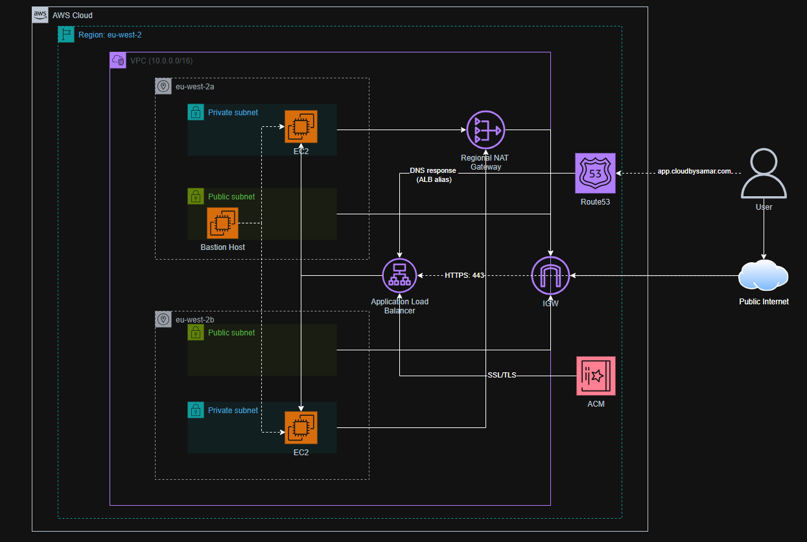

## Implementation Steps

### Step 1: VPC Creation

A Virtual Private Cloud (VPC) provides an isolated networking environment within AWS, similar to a traditional on-premises network. All resources in this project are deployed within this VPC.

**Configuration details:**
- A custom VPC was created with an IPv4 CIDR block of `10.0.0.0/16`
- This CIDR range provides sufficient address space for multiple subnets across Availability Zones
- The VPC serves as the foundational networking layer for all subsequent components

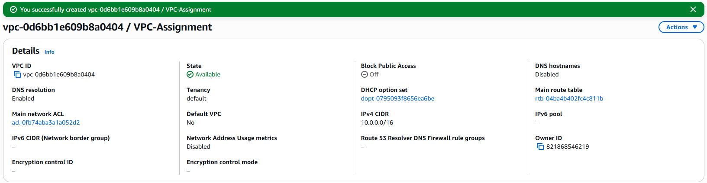

### Step 2: Subnet Creation

Subnets were created to logically divide the VPC into public and private network segments across two Availability Zones. This enables high availability, fault tolerance, and controlled exposure to the internet.

**Configuration details:**
- Four subnets were created across two Availability Zones:
  - Two public subnets (one per AZ) for internet-facing resources
  - Two private subnets (one per AZ) for application compute resources
- Each subnet was assigned a `/24` IPv4 CIDR block for clear IP segmentation
- Public and private subnets were distributed evenly across Availability Zones to support high availability
- Private subnets do not assign public IP addresses to resources by default

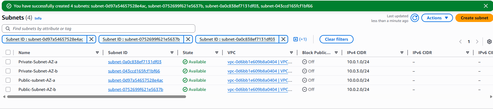

### Step 3: Internet Gateway

An Internet Gateway (IGW) enables communication between resources in the VPC and the public internet. It is required for any public subnet that needs inbound or outbound internet access.

**Configuration details:**
- An Internet Gateway was created and attached to the custom VPC
- The IGW enables public subnets to route traffic to and from the internet
- Only public subnets will later be associated with route tables that forward traffic to the IGW

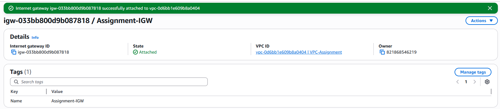

### Step 4: Regional NAT Gateway

A NAT Gateway allows instances in private subnets to initiate outbound connections to the internet while remaining unreachable from inbound internet traffic. In this project, a **Regional NAT Gateway** was used to improve availability and simplify multi-AZ network design.

**Configuration details:**
- A Regional NAT Gateway was created within the VPC
- Regional mode allows the NAT Gateway to automatically scale across Availability Zones
- The NAT Gateway was configured as a **public** NAT to provide internet egress for private subnets
- Elastic IP addresses were allocated automatically by AWS for simplified management
- Private subnets will later route outbound traffic to the NAT Gateway

### Step 5: Route Tables

Route tables control how network traffic is directed within the VPC. Separate route tables were configured for public and private subnets to enforce secure and predictable traffic flow.

**Public route table configuration:**
- Associated with public subnets in each Availability Zone
- Contains a default route (`0.0.0.0/0`) pointing to the Internet Gateway
- Enables inbound and outbound internet access for public-facing resources

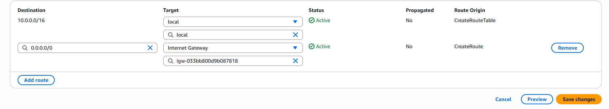

**Private route table configuration:**
- Associated with private subnets in each Availability Zone
- Contains a default route (`0.0.0.0/0`) pointing to the Regional NAT Gateway
- Allows private instances to initiate outbound internet connections while remaining unreachable from the public internet

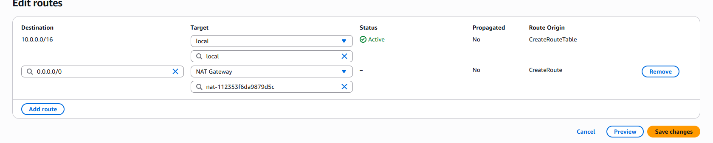

### Step 6: Security Groups

Security Groups act as stateful virtual firewalls that control inbound and outbound traffic to AWS resources. Separate security groups were created for each layer of the architecture to enforce the principle of least privilege.

**Private EC2 Security Group:**
- Allows inbound SSH (port 22) traffic **only** from the Bastion Host security group
- Allows inbound HTTP (port 80) traffic **only** from the Application Load Balancer security group
- Prevents any direct inbound access from the public internet

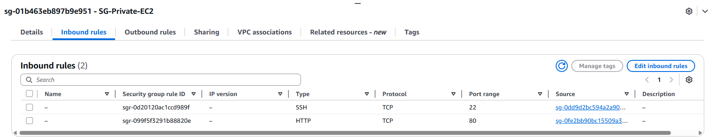

**Application Load Balancer Security Group:**
- Allows inbound HTTP (port 80) traffic from the public internet (`0.0.0.0/0`)
- Acts as the single public entry point for application traffic
- Forwards traffic securely to private EC2 instances

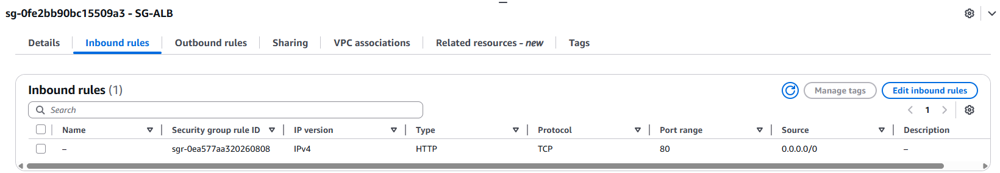

**Bastion Host Security Group:**
- Allows inbound SSH (port 22) traffic **only** from a trusted IP address
- Provides controlled administrative access to private EC2 instances
- Eliminates the need for public SSH access on private resources

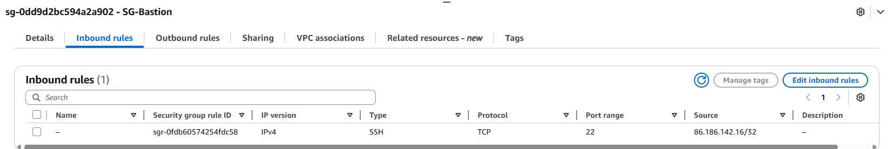

### Step 7: EC2 Instances

Elastic Compute Cloud (EC2) instances were deployed to host the application workload and provide controlled administrative access. The architecture uses private EC2 instances for application services and a bastion host in a public subnet for secure access.

**Private EC2 instances (Application layer):**
- Two EC2 instances were launched in private subnets across different Availability Zones
- Instances do not have public IP addresses, ensuring they are not directly reachable from the internet
- Each instance runs an NGINX web server installed via user data
- Security is enforced using a dedicated security group that only allows:
  - HTTP traffic from the Application Load Balancer
  - SSH access from the Bastion Host

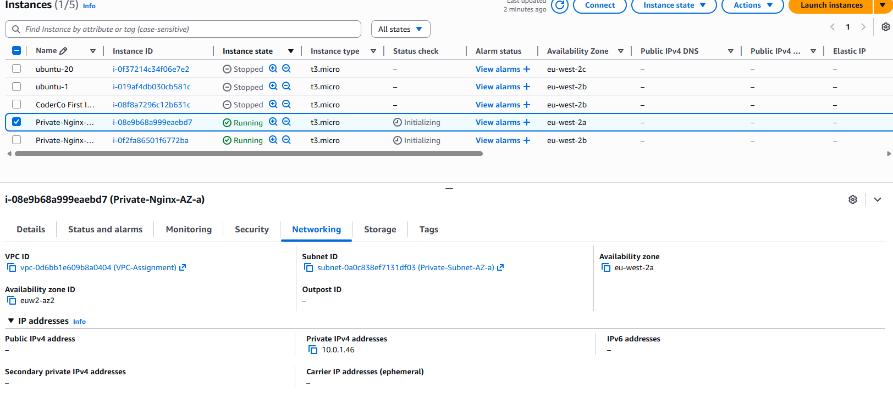

**Bastion host:**
- A single EC2 instance was launched in a public subnet
- Assigned a public IPv4 address to allow SSH access from a trusted IP
- Used as a secure jump host to access private EC2 instances
- Eliminates the need for exposing private instances directly to the public internet

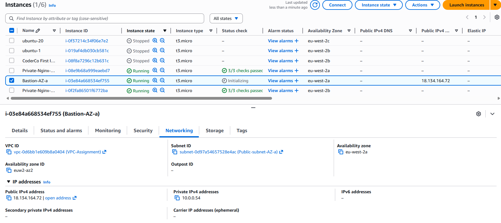

### Step 8: Bastion Host Access

A bastion host was used to provide secure administrative access to resources inside the private subnets. This ensures that no private EC2 instances are directly exposed to the public internet.

**Actions performed:**
- Established an SSH connection to the bastion host using its public IPv4 address
- Access was restricted to a trusted IP address via the bastion security group
- The bastion host acts as a controlled entry point into the VPC

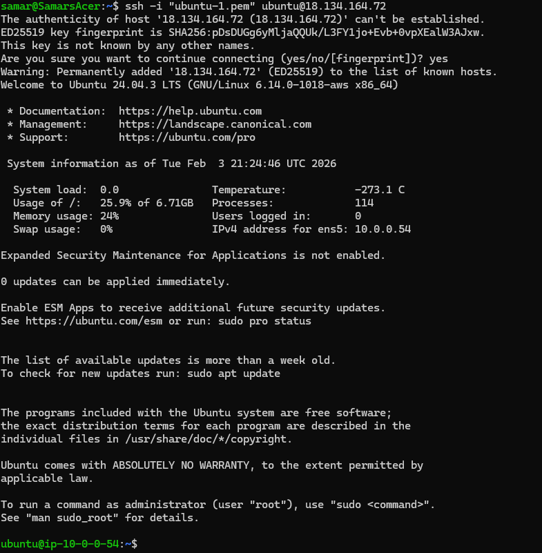

### Step 9: Private EC2 Access & Application Validation

After accessing the VPC via the bastion host, a private EC2 instance was accessed using its private IP address. This step validates internal network connectivity, routing, and security controls within the VPC.

**Validation steps performed:**
- Initiated an SSH connection to the private EC2 instance from the bastion host
- Confirmed the instance is deployed in a private subnet and does not have a public IP address
- Verified that the NGINX web server is running on the private EC2 instance

The following command was executed on the private EC2 instance to validate application availability:

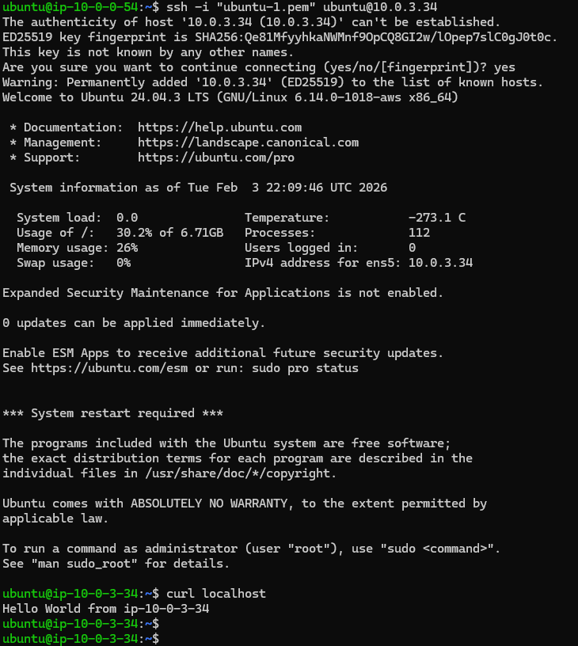 

### Step 10: Target Group Configuration

A target group was created to define where the Application Load Balancer will forward traffic. The target group registers the private EC2 instances running NGINX and performs health checks to ensure traffic is only sent to healthy instances.

**Configuration details:**
- Target type: **Instance**
- Protocol/Port: **HTTP: 80**
- Health check protocol: **HTTP**
- Health check path: `/`
- Targets: **2 private EC2 instances**, one in each Availability Zone

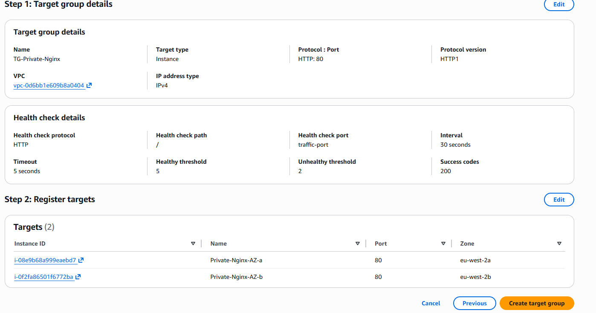

The private EC2 instances were registered as targets so the ALB can distribute traffic across both Availability Zones.

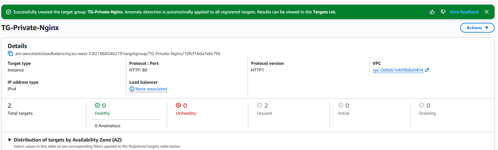

### Step 11: Application Load Balancer

An Application Load Balancer (ALB) was deployed to distribute incoming traffic across private EC2 instances running the application. The ALB serves as the public entry point to the architecture while keeping application instances isolated within private subnets.

**Configuration details:**
- Load balancer type: **Application**
- Scheme: **Internet-facing**
- Deployed across public subnets in multiple Availability Zones
- Listener configured on **HTTP (port 80)**
- Listener forwards traffic to the private EC2 target group (`TG-Private-Nginx`)
- Health checks ensure traffic is only sent to healthy targets

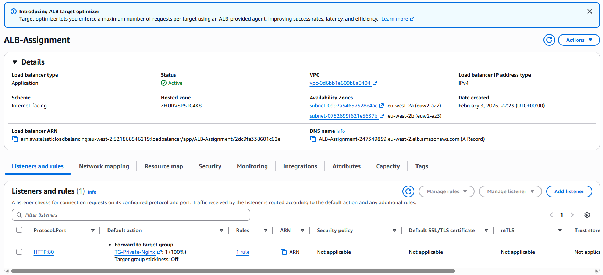

### Step 12: Application Load Balancer Validation

Before configuring DNS and HTTPS, the Application Load Balancer was validated using its AWS-provided DNS name. This confirms that the load balancer, target group, and private EC2 instances are correctly integrated.

**Validation steps performed:**
- Accessed the ALB DNS name in a web browser
- Observed responses from different private EC2 instances on page refresh
- Confirmed successful traffic forwarding from the ALB to the target group

The responses below show traffic being served by different private EC2 instances, confirming load balancing across Availability Zones.

### Step 13: HTTPS, TLS, and Custom Domain Configuration

To secure inbound traffic, HTTPS was configured using AWS Certificate Manager (ACM) and Amazon Route 53.

An ACM certificate was requested for the custom domain and wildcard subdomain and validated using DNS validation. Once the certificate status was issued, it was attached to the Application Load Balancer as an HTTPS (443) listener.

The HTTPS listener forwards encrypted traffic to the private EC2 target group running NGINX.

The HTTP (80) listener was configured to redirect all requests to HTTPS (443) using a **301 Permanent Redirect**, ensuring all client traffic is encrypted in transit by default.

An Alias A record was then created in Route 53 to map the custom domain to the Application Load Balancer DNS name. This allows users to access the application securely using HTTPS without exposing backend instances.

Finally, the setup was verified by accessing the application via the custom domain and observing successful load balancing between private EC2 instances.

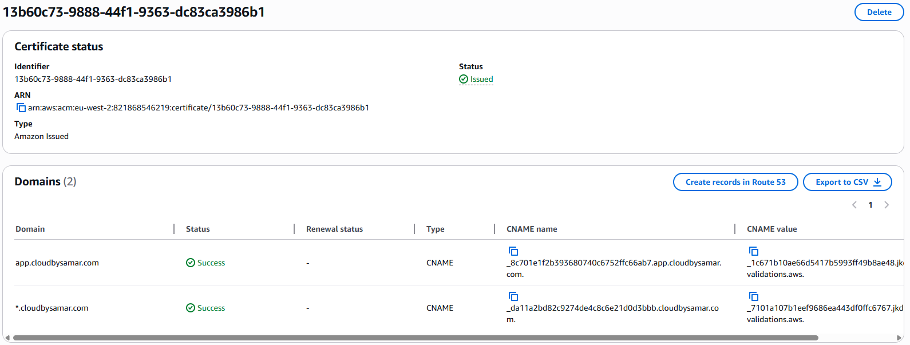

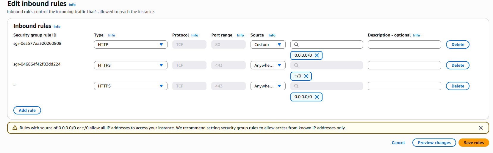

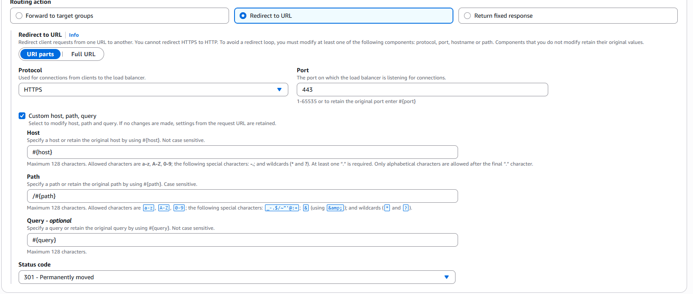

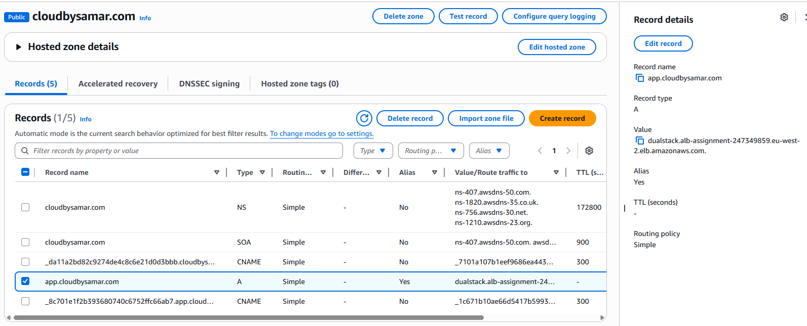

## Verification & Results

- Verified connectivity to private EC2 instances via a Bastion Host.
- Confirmed outbound internet access from private subnets through a Regional NAT Gateway.
- Validated Application Load Balancer routing traffic across multiple Availability Zones.
- Verified HTTPS access using an ACM-issued TLS certificate.
- Confirmed HTTP (port 80) requests are redirected to HTTPS (port 443) using a 301 redirect.
- Confirmed DNS resolution via Route 53 Alias record pointing to the ALB.
